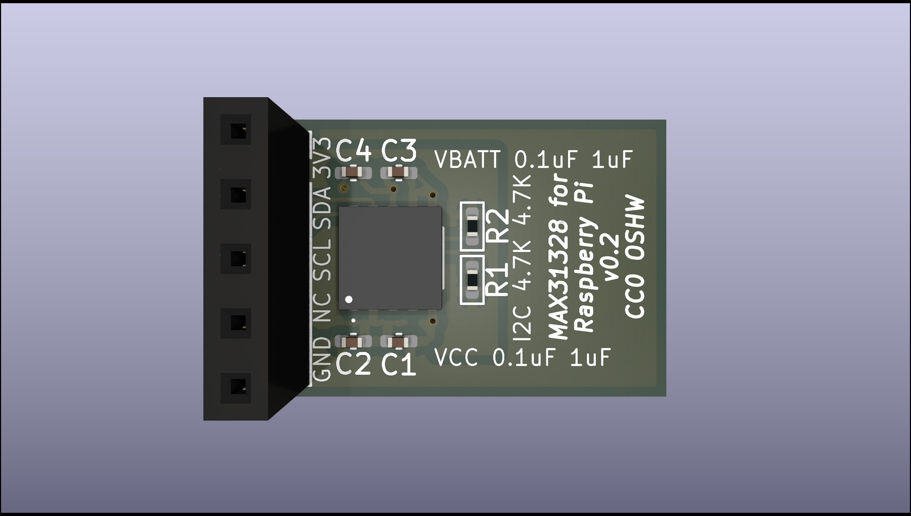

# MAX31328-based RTC module for Raspberry Pi



## Rationale
The MAX31328 is the updated (and cheaper!) refresh of the venerable DS3231 RTC chip, although there's very few MAX31328 based time modules for Pi, and even fewer in the tiny footprint of the usual Aliexpress special RTC module. Also I wanted to learn KiCAD some more. :)

## Installation
In your /boot/firmware/config.txt file add the line ```dtoverlay=i2c-rtc,ds3231``` at the end, then turn the Pi off, then plug the 5 pin header into pins 1, 3, 5, 7 and 9 (+3V3, SDA, SDL, not connected, GND, respectively), then turn it back on. If it worked, you should see something happen when running ``hwclock -w``. Since the MAX31328 is a drop-in replacement for the DS3231 you may notice that these instructions are the same as any RTC module using that particular chip.

## Building the PCB
Import project files into KiCad 8 and export to your PCB manufacturing service of choice, or just use the files in the grbl subfolder.

## BOM
1. MAX31328: the star of the show, accept no substitutes. 
2. Battery holder: Keystone Electronics 3030. This takes CR927 or CR1025 non-rechargeable 3V lithium coin cells. It isn't as compact as the RTC modules with the bare tabs soldered on the board, but you can replace the battery on this one without breaking out the soldering iron.
3. I2C pullups: 2x 4.7kohm 0402 resistors, although I think you can get away with using the Pi's built in I2C pullups.
4. Decoupling caps: two pairs of 1uF + 0.1uF 0402 capacitors, one pair for VCC (the Pi) and the other pair for VBATT (the battery).
5. Pin headers: right angle or straight, just as long as it'll fit onto the Pi's GPIO pins

## Contributing
Feel free to do what you like with this; build it, change it, fix it, sell it, whatever. If you do make improvements it'd be super cool to make those publicly available.

## License
[CC0-1.0](LICENSE)
